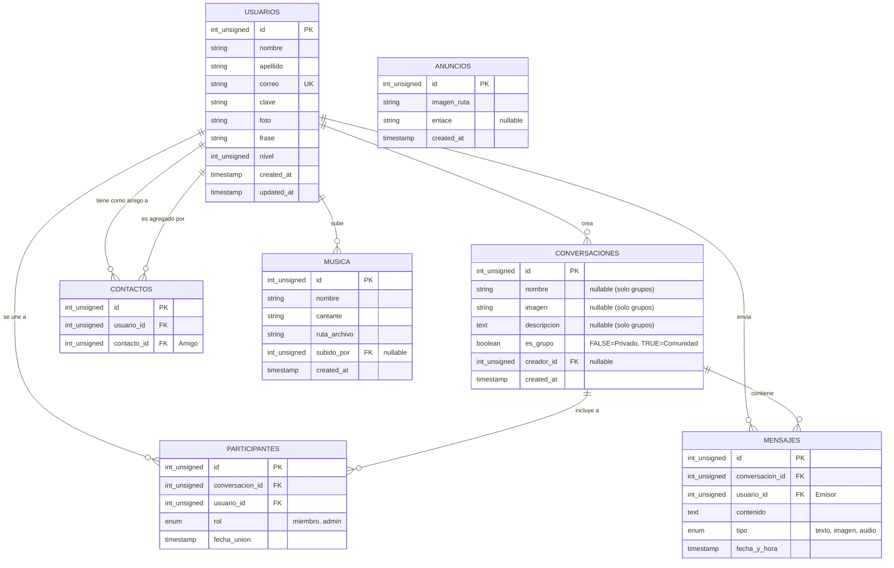

```mermaid
erDiagram
%% --- ENTIDADES ---

    USUARIOS {
        int_unsigned id PK
        string nombre
        string apellido
        string correo UK
        string clave
        string foto
        string frase
        int_unsigned nivel
        timestamp created_at
        timestamp updated_at
    }

    CONVERSACIONES {
        int_unsigned id PK
        string nombre "nullable (solo grupos)"
        string imagen "nullable (solo grupos)"
        text descripcion "nullable (solo grupos)"
        boolean es_grupo "FALSE=Privado, TRUE=Comunidad"
        int_unsigned creador_id FK "nullable"
        timestamp created_at
    }

    PARTICIPANTES {
        int_unsigned id PK
        int_unsigned conversacion_id FK
        int_unsigned usuario_id FK
        enum rol "miembro, admin"
        timestamp fecha_union
    }

    MENSAJES {
        int_unsigned id PK
        int_unsigned conversacion_id FK
        int_unsigned usuario_id FK "Emisor"
        text contenido
        enum tipo "texto, imagen, audio"
        timestamp fecha_y_hora
    }

    CONTACTOS {
        int_unsigned id PK
        int_unsigned usuario_id FK
        int_unsigned contacto_id FK "Amigo"
    }

    MUSICA {
        int_unsigned id PK
        string nombre
        string cantante
        string ruta_archivo
        int_unsigned subido_por FK "nullable"
        timestamp created_at
    }

    ANUNCIOS {
        int_unsigned id PK
        string imagen_ruta
        string enlace "nullable"
        timestamp created_at
    }

    %% --- RELACIONES ---

    %% Un Usuario crea muchas Conversaciones (Grupos)
    USUARIOS ||--o{ CONVERSACIONES : "crea"

    %% Un Usuario pertenece a muchas Conversaciones a través de Participantes (N:M)
    USUARIOS ||--o{ PARTICIPANTES : "se une a"
    CONVERSACIONES ||--o{ PARTICIPANTES : "incluye a"

    %% Un Usuario envía muchos Mensajes (1:N)
    USUARIOS ||--o{ MENSAJES : "envia"
    %% Una Conversación contiene muchos Mensajes (1:N)
    CONVERSACIONES ||--o{ MENSAJES : "contiene"

    %% Relación Recursiva de Contactos (N:M entre Usuarios)
    USUARIOS ||--o{ CONTACTOS : "tiene como amigo a"
    USUARIOS ||--o{ CONTACTOS : "es agregado por"

    %% Un Usuario sube mucha Música (1:N)
    USUARIOS ||--o{ MUSICA : "sube"

```
